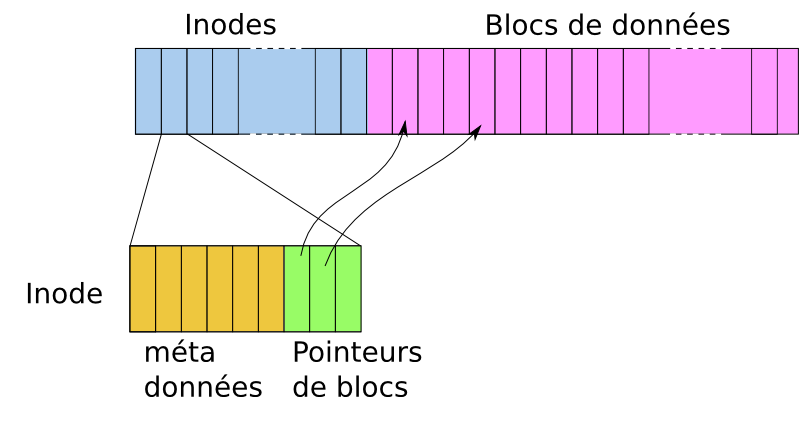

# Cours Système - `BASH`

*[lien vers le killercoda](https://killercoda.com/emelin)*  
  
##
## Cours n°1 - 08/09/2023

### 1.1
- Ouvrir un terminal <kbd>Ctrl</kbd> + <kbd>Alt</kbd> + <kbd>T</kbd>.
- Chemin absolu du home de *john* : `/home/john/`.
- `home` est un dossier qui contient tous les dossiers personnels des utilisateurs.
-  ⬆️ ou ⬇️ pour accéder à l'historique des commandes.
-  ⬅️ ou ➡️ pour corriger dans la ligne.

### 1.2

#### La commande `ls` - list :
- `ls` : permet d'afficher la liste des dossiers et fichiers du dossier actuel

#### La commande `cd` - Change Directory :`
- `cd <nom_dossier>` : permet de se déplacer dans un dossier enfant.
- `cd ` : permet de se déplacer dans son home, repéré par le ~ (<kbd>AltGr</kbd> + <kbd>2</kbd>).
- `cd ..` : permet de remonter dans le dossier parent.
- `cd ../../` : permet de remonter dans le dossier grand-parent.

### 1.3
- `cat <addresse_vers_fichier>` permet de lire le contenu d'un fichier.
- <kbd>Tab</kbd> : autocomplétion du début d'une commande.

### 1.4
- `ls <nom_dossier>` : permet d'afficher la liste des dossiers et fichiers du dossier nom_dossier.
- **chemin relatif** `ls <chemin>` ou `cat <chemin>`: est un chemin qui dépend de l'endroit où l'on est.
- `ls ..` ou aussi `ls ../<chemin>`: permet de lister le contenu du dossier parent.

- **chemin absolu** `ls /<chemin>`: est un chemin qui ne dépend pas de la où je me trouve.

### 1.5
- le premier mot d'une ligne est une **commande** (= un fichier exécutable).
- les autres mots sont des arguments.
- `-v` *par exemple* est une option car il y a un tiret (*convention*).
- En version longue, il s'écrive avec deux tirets.

  * Les commandes les plus indispensables sont dans le répertoire `/bin/`,
  * Les commandes accessibles à tous les utilisateurs sont dans le répertoire `/usr/bin/`,
  * Certaines commandes ne sont accessibles qu'aux administrateurs du système. Les commandes d'administration sont dans le répertoire `/sbin/`.
 
 ### 1.6`
 - `tree ..` : permet d'afficher l'arborescence du dossier parent.
 - `tree .` : permet d'afficher mon home.
 - `cd ~` : emmène directement dans mon home.
  `
##
## Cours n°2 - 15/09/2023

- `ls -l` : permet de voir la dernière date de modification d'un fichier
- `nano <chemin>` : pour éditer un nouveau fichier et ouvre un éditeur de fichier
- `mkdir <répertoire>` : créer un dossier
- `mkdir -r <répertoires>` : créer plusieurs dossier grâce à l'option `-r` (`--recursive`)
- `mkdir <arguments>` : créer plusieurs sous-dossier rapidement
- `touch <chemin vers un fichier>` : permet de mettre à jour (l'heure) de dernière modification
- `touch <chemin vers un fichier inexistant>` : créer un fichier vide
- `rm <chemin vers un fichier>` : permet de supprimer un **fichier**
- `rm -r <chemin vers un dossier>` ou `rm --recursive <chemin vers un dossier>` : efface tout les dossiers et fichiers qui sont les enfants du dossier et le dossier
- ⚠️ `rm -r /` : efface tout l'ordinateur
- `du <chemin vers un dossier>` : permet de connaître la taille d'un répertoire (`du` : *disk usage*)
- `du -s <dossier>` : fait la somme de l'espace disque utilisé
- `du -h <dossier>` : affiche la taille avec une unité plus facile à lire

#### option :
- `-a` ou `-- all` : permet de voir tous les fichiers/dossiers (même les fichiers cachés qui sont identifiés par `.<nom_fichier>`)
- `-l` : permet de donner plus d'informations sur les fichiers/dossiers

### 2.7
- `ps -o pid` : permet d'afficher
  * TTY : le terminal correspondant au processus
- `ps -aux` : permet de lister tout les processus de la machine
- <kbd>ctrl</kbd>+<kbd>z</kbd> et <kbd>ctrl</kbd>+<kbd>c</kbd> permettent respectivement d'envoyer **SIGSTOP** et **SIGINT** à un processus.
- `fg` et `bg` permettent respectivement de mettre en avant-plan et en arrière plan un processus préalablement gelé (avec SIGSTOP ou ctrl+z)
  
##
## Cours n°3 - 15/09/2023 et 22/09/2023

### 3.1 - Droits des fichiers
`ls -l` :
- `-rw-r----- 1 sasha  etu  495 juil. 16 08:52: fichier1.txt`
  * `fichier1.txt` : nom du fichier`
  * `juil. 16 08:52` : date et heure de la dernière modification du fichier
  * `495` : taille en **octets** du fichier
  * `sasha etu` : le fichier appartient à l'utilisateur *sasha* et est dans le groupe *etu*
  * `1` : nombre de lien qui pointe vers ce fichier
- `-rw-r-----` : 
  * le premier `-` indichemin_endroit_delaque qu'il s'agit d'un **fichier**
    * `-` quand c'est un fichier ou `d` quand c'est un dossier ou `l` quand c'est un lien
  * `r` (read - **droit de lecture**) : on peut lire le fichier
  * `w` (write - **droit d'écriture**) : on peut modifier le contenu du fichier
  * `x` (execute - **droit d'execution**) : on peut executer le fichier
  * les autres `-` : absence de droit de **lecture**/**écriture**/**execution** (en fonchemin_endroit_delaction de la position du caractère `-`)
  * `r--` : indique les droits des **membres du groupe** (*ici que le droit de lecture*)
  * les trois derniers `---` indique les droits de tous les **autres utilisateurs**.

  - `cp` : copier un fichier``
  - `grep` : rechercher un mot dans un fichier
 
### 3.2 - Modification des droits des fichiers
  - `chmod` : permet de modifier les droits d'un fichier/dossier qui m'appartient (propriétaire et accès)

  `chmod <ugoa><+|-><rwx> nom_fichier` :  
    - `u` : pour les droits de l'utilisateur  
    - `g` : pour les droits du groupe  
    - `o` : pour les droits des autres utilisateurs  
    - `a` : pour les droits de tout le monde  
    - `+` : pour ajouter un droit  
    - `-` : pour retirer un droit  
    - `rwx` : comme avant pour lire, écrire, exécuter  
  on peut mettre par exemple (`og-r`) ou encore (`ug+r, o-x`) 

### 3.3 - Commande `mv`
  - `mv <fichiers> <nouvel_endroit>` : permet de déplacer de(s) fichier(s) dans un dossier
    - le chemin du(des) fichier(s) qu'on veut déplacer <warning> Mettre un `/` à la fin quand il s'agit de déplacer un dossier.
    - le chemin de l'endroit où on veut le mettre
  - `mv <fichiers> <nouveau_nom_fichier>` : permet de renommer un fichier 
      * option : `-m` : pour ne pas écraser le fichier existant

### 3.4 - Commande `man <commande>`
La commande `man` correspond à l'aide sur une commande (*help*).

### 3.5 - Commande `cp`
  - `cp <chemin_fichier_à_copier> <chemin_endroit_dela_copie>` : permet de faire une copie du ou des fichier(s) dans un autre dossier

### 3.6 - Introduction aux scripts
(penser à avoir ajouter les droits d'exécution `chmod`)
- Pour exécuter du bash : `bash <nom_fichier>` == recommandé : **`./<nom_fichier>`**
- Pour exécuter du Python3 : `python3 <nom_fichier>`
Pour savoir où se trouve par exemple bash : `which bash`
Dans un fichier *bash* la première ligne doit toujours être : `#!/bin/bash` est composée du chemin vers l'interpréteur bash (`/bin/bash`)

### 3.7 - Les variables
Exemple : `prenom="Alice"` ATTENTION : il ne faut pas mettre d'espace entre *prenom*, *=* et *Alice*

##
## Cours n°4 - 29/09/2023 

### 4.1 - Droits des utilisateurs
- commande `sudo` pour exécuter une commande en tant que **root**

### 4.2 - Redirection des sorties vers un fichier
Par exemple : `ls -l > essai.txt` la sorti a été redirigé vers le fichier essai.txt et on peut donc l'afficher en faisant : `cat essai.txt`
on peut mettre plusieurs arguments puis `>`.
- Mettre `>>` pour redirigé dans le fichier sans écrasé ce qui est déjà dessus.
- Mettre `2>` pour redirigé dans un fichier **seulement la sortie d'erreur** et affiche la sortie standard (s'il y en a une).  
- Mettre `commande arg1 arg2 arg3 2> sortie_erreur.log > sortie_standard` : pour redirigé dans un fichier la sortie d'erreur et dans un autre fichier la sortie standard.  
- Mettre `2> /dev/null ` : pour envoyer dans le **trou noir** la sortie d'erreur.  
2> /dev/null 

### 4.3 - Script et arguments
Mettre des "" ou '' pour faire un seul arguments qui peut donc comporter des espaces ou remplacer les espaces par `\`.
Pour faire une opération utiliser `expr "<arg>" "<+ * />" "<arg>"` ou `$(<args>)`.  
`$1` : premier argument
`$#` : nombres d'arguments
`read` : lire et stocker ce qui est mit en entrée standard
script qui lit ce qui est mit en entrée standard et le renvoie :
```bash
#!/bin/bash
read phrase
echo phrase
```


### 4.4 - Installation de programmes
Pour installer un programme utiliser `apt`

Les paquets sont récupérés dans des dépôts. Initialement, lorsque tu as installé ton système, des dépôts "officiels" d'ubuntu sont configurés : ce sont des sites web les logiciels standards testés par ubuntu. Ils sont présents dans le fichier /etc/apt/sources.list .
- Pour installer un paquet : `sudo apt install <paquet>`.
- Pour désinstaller un paquet : `sudo apt purge <paquet>`.
- Pour mettre à jour la liste des paquets : `sudo apt update`.  
- Pour mettre à jour **tout** les paquets : `sudo apt upgrade`.
- La première chose à faire est de mettre à jour localement (dans ton système) la liste des logiciels installables, ce qui revient à mettre à jour la liste des paquets. Pour cela, utilise par exemple la commande sudo apt update.

### 4.5 - Les jokers
`echo b*` : affiche tout les fichiers qui commencent par un b...  
D'autres motifs que * existent pour enrichir les possibilités, tel que :
  - `echo [br]*` qui correspond à tous les mots qui commencent par b ou r.
  - `echo {ba,re}*` qui correspond à tous les mots qui commencent par "ba" ou "re".
  - `<commande *{lettres1, lettres2}>` qui correspond à tous les mots qui terminent par "lettre1" ou "lettre2"
On peut garder un caractère cpechogrepmvrmen l'encadrant avec : `""`, `''` ou `\<caractère>`.

##
## Cours n°5 - 06/10/2023 

### 5.1 - Droits - Episode n°2 : Droits des dossiers
Par exemple : `drwxrwxr-x 2 sasha etu 4096 juil. 16 13:31 Documents` : le premier `d` signifie que "**Documents**" est un dossier.  
Si a la place de `d` il y a un `-` cela signifie que c'est un fichier.  
*Avoir les droits d'exécution d'un dossier signifie que l'on y a accès, que l'on peut l'ouvrir et le traverser mais pas forcement regarder son contenu !*  
- Pour lister le contenu d'un dossier (`ls`) ou effectuer des recherches dans le dossier (`find`), il faut **avoir** les droits de **lecture**.  

### 5.2 - Droits - Episode n°4 : Les inodes
Le **système d'un fichier** : c'est un<e façon de stocker les informations et de les organiser dans un espace disque.  
Les **blocs de données** contiennent les données des fichiers (ce qu'on va voir en regardant le contenu hexadécimal d'un fichier).  
Les **inodes** contiennent les méta-données : permissions, taille du fichier, date de dernière modification, etc. ainsi que l'indication de l'endroit où se trouvent les données associées comme le montre le zoom sur l'image suivante :  

  

➟ Pour connaître le numéro d'inode des fichiers: `ls -i`.
- Dans les données d'un dossier il y a :
    - le **nom** des fichiers,
    - les **numéros** d'inodes de ces fichiers.
- les répertoires sont des associations nom -> numéro d'inode.: pour redirigé dans un fichier la sortie d'erreur et dans un autre fichier la sortie standard.  
- Mettre `2> /dev/null ` : pour envoyer dans le **trou noir** la sortie d'erreur.  
2> /dev/null 
- commande `ln <fichier1> <fichier2>` : créer un lien physique (si on change quelque chose dans le fichier1, ça le change aussi dans le fichier2 - Par contre si on supprime le fichier1, ça ne supprime pas le fichier2).  


##
## Cours n°6 - 13/10/2023 

### 6.1 - Focus sur la commande `cut`
- `grep` est une commande qui affiche sur sa sortie standard toutes les lignes du fichier passé en deuxième argument contenant la chaine passée en premier argument
- La commande `cut -f <colonne(,s)` : permet de se concentrer sur une seul colonne d'un fichier csv

### 6.2 - Le statut de sortie
- Le **statut de sortie** de la commande est 0 lorsque "tout se passe" bien, et 2 lorsque le répertoire passé en argument n'existe pas.
- La commande `test` permet de comparer des chaines de caractère ou des entiers, mais aussi de tester l'existence de fichiers.
L'option `-ge` ou `-eq` signifie greater or equal et  l'option `-e` signifie exists.

### 6.3 - Redirection de l'entrée standard à partir d'un fichier
- La commande `wc` permet d'afficher le nombre de lignes, mots et octets de chaque fichier passé en argument
- On redirige l'entrée standard à partir d'un fichier avec le caractère `<`.
- Les commandes `rm`, `echo`, `mv`, `ls`, `cp`,  ne sait pas lire les entrées à partir d'un fichier.
- La commande `tr args1 args2 < mot` transforme les éléments de mot qui correspondent à args1 en args2.
- `tr` : mot en miniscule en majuscule : `tr [lower:] [:upper] < mot`

### 6.4 - Les conditions en bash
```bash
if test -e /home/
then
 echo "Le dossier /home/ existe !"
else
 echo "Le dossier /home/ n'existe pas !"
fi
```
*Voici ce qui se passe* : La commande `if` exécute ce qui est écrit juste après (ici la commande `test`), puis teste le statut de sortie. Si ce statut de sortie est `0` il exécute ensuite ce qui est dans le `then`, sinon il exécute ce qui est dans le `else`.
- La commande `test <testing>` peut être écrite : `[ <testing> ]`. <warning>Les espaces sont très importants !</warning>

##
## Cours n°7 - 13/10/2023 

### 7.1 - Pipelines
```bash
#!/bin/bash
ls $1 > fichier
wc -l < fichier
```
- Compte le nombre de dossier/fichier dans le répertoire `$1` passé en argument (ici pas de pipeline).
- Il est possible de connecter directement la sortie standard d'une commande à l'entrée standard d'une autre commande. Cela se fait à l'aide de pipeline `|` (<kbd>AltGr</kbd>+<kbd>6</kbd>).
- La commande `head -X FILE` permet d'afficher les X premières lignes d'un fichier FILE
- La commande `tail -X FILE` permet d'afficher les X dernières lignes d'un fichier FILE
- La commande `head -X FILE | tail -Y` permet d'afficher les Y dernières lignes des X premières lignes d'un fichier FILE

### 7.2 - Introduction aux expressions régulières
Les caractères : `^` correspond au début de ligne et `$` à la fin de ligne.
La construction suivante permet de spécifier une correspondance pour un motif ou un autre : `grep -E "on|ou" FILE`

##
## Cours n°8 - 13/10/2023 

### 8.1 - Scripts et boucle `for`
```bash
#!/bin/bash

for variable in 'valeur1' 'valeur2' 'valeur3'
do
        echo "Coucou"
        echo "chers étudiants"
done
```
Afin de manipuler la sortie d'une commande en tant que chaîne de caractères, il faut utiliser la syntaxe dite *backquoting*. Cela consistera à entourer la commande par `$(...)`.

### 8.2 - Bash et Python
Exemples : 
```bash
#!/usr/bin/python3
# Auteur :  A. B.
# Ce script dit bonjour
print("Bonjour")
```

##
#### Informations :

>Evaluation le 20 octobre 2023 sur papier de 15h30 à 17h00.**

### Important :
- Droits et dossier (5.1)
- Redirection de l'entrée standard à partir d'un fichier (6.3)
- Les conditions en bash (6.4)
- Pipelines (7.1)

### Moins important
- Inodes (5.2)
- Le statut de sortie (6.2)
- Boucle for (8.1) - Pour les TPs